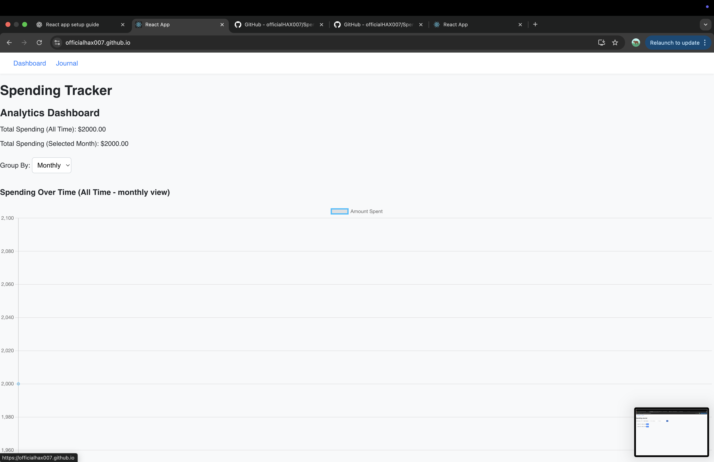
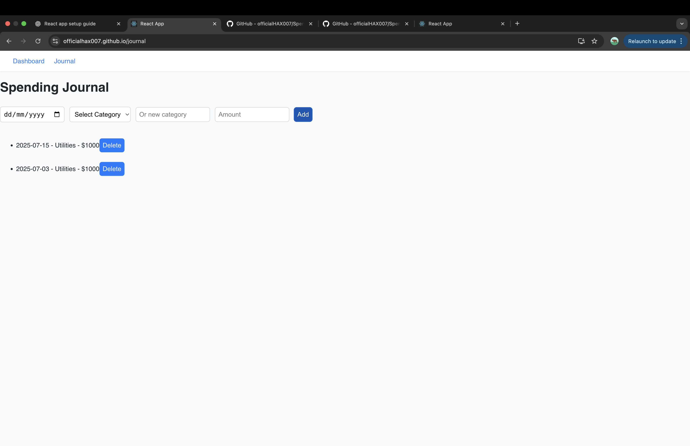
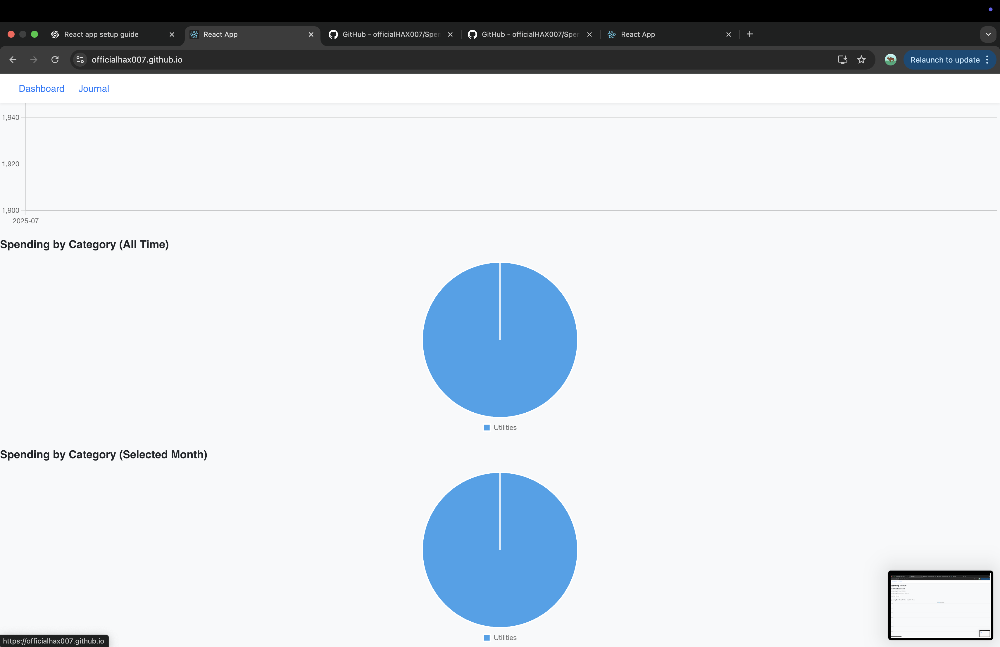

# Spending_Tracker

## Group Members:
- Min Khant Aung  
- San Lin Htet  
- Htoo Pyae Sone Htun  

---

## 🧾 Project Overview  
This is a Spending Tracker Web App built with React.js.  
It is a fully client-side application (no backend) and uses `localStorage` to save data across sessions.

---

## 🔍 Features

### 📘 1. Journal Page
- Users can record daily spending entries.
- Each entry includes:
  - Date
  - Category
  - Amount
- Users can:
  - Select from existing categories
  - Add new custom categories
  - Delete incorrect entries
- All data is saved using `localStorage`.

### 📊 2. Dashboard Page
- View analytics summary by:
  - Daily
  - Weekly
  - Monthly
- Shows:
  - Total spending (all time)
  - Total spending (selected month)
  - **Line chart** of spending over time
  - **Pie chart** of category distribution

---

## 🛠️ Technologies Used
- React.js (frontend framework)
- Chart.js (for charts)
- Tailwind CSS (for styling)
- LocalStorage (for data persistence)
- React Router (for navigation)

---

## 🌐 Deployment

Deployed via GitHub Pages:  
**🔗 [https://officialHAX007.github.io/Spending_Tracker/](https://officialHAX007.github.io/Spending_Tracker/)**

GitHub Repo:  
**🔗 [https://github.com/officialHAX007/Spending_Tracker](https://github.com/officialHAX007/Spending_Tracker)**

---

## 📸 Screenshots






---

## ✅ How to Run Locally

```bash
npm install
npm start
